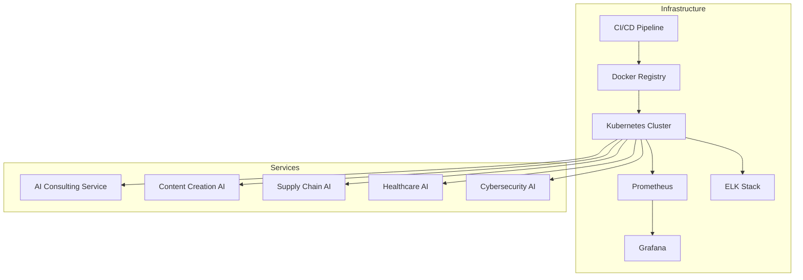
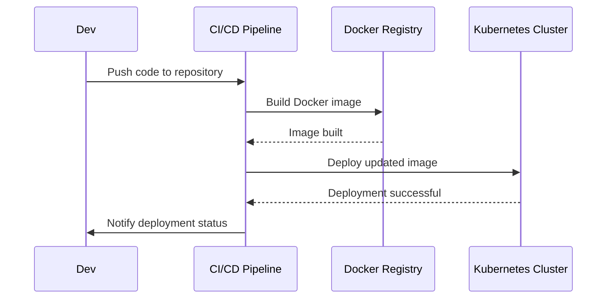

# Complete Deployment Package

This repository contains all the necessary crates, Docker configurations, Kubernetes manifests, and automation scripts to deploy AI services using Kubernetes and Docker. It leverages continuous integration and deployment pipelines to ensure a seamless and reliable workflow.

## Table of Contents

- [Architecture Overview](#architecture-overview)
- [Core Services](#core-services)
- [Infrastructure](#infrastructure)
- [Getting Started](#getting-started)
- [Development](#development)
- [Deployment](#deployment)
- [Testing](#testing)
- [Contributing](#contributing)
- [Disaster Recovery](#disaster-recovery)
- [License](#license)

## Architecture Overview

The platform consists of multiple specialized AI services, each running as a containerized microservice:

### Core Services

- **AI Consulting Service** (Port: 8080)
  - Real-time predictions
  - OpenAPI documentation
  - Prometheus metrics
  - Health monitoring

- **Content Creation AI** (Port: 8084)
  - Media generation
  - Text summarization
  - Content personalization
  - Dynamic content adjustment

- **Supply Chain AI** (Port: 8080)
  - Inventory optimization
  - Demand forecasting
  - Supply chain analytics

- **Healthcare AI** (Port: 8089)
  - Patient data analysis
  - Medical predictions
  - HIPAA-compliant processing

- **Cybersecurity AI** (Port: 8090)
  - Threat detection
  - Anomaly detection
  - Security metrics

### Infrastructure

- **Kubernetes Deployment**
  - NVIDIA GPU support
  - Resource management
  - Auto-scaling
  - Load balancing

- **Monitoring & Logging**
  - Prometheus metrics
  - Structured logging
  - Health checks
  - Performance tracking

## Getting Started

### Prerequisites

- Rust (latest stable version)
- Docker
- Kubernetes cluster with NVIDIA GPU support
- kubectl CLI

### Quick Start

1. Clone the repository:
   ```bash
   git clone https://github.com/your-username/your-repo.git
   cd your-repo
   ```

2. Configure environment:
   ```bash
   cp .env.example .env
   # Edit .env with your configurations
   ```

3. Run setup script:
   ```bash
   ./scripts/setup.sh
   ```

## Development

### Common Commands

```bash
# Start development environment
make dev

# Run all checks
make check-all

# Run tests
make test

# Build Docker images
make docker-build docker-push

# Deploy to Kubernetes
make deploy
```

### Service Structure

Each service follows a consistent structure:
- API endpoints
- Error handling
- Metrics collection
- Health checks
- Integration tests

### Testing Strategy

- Unit tests for core logic
- Integration tests for API endpoints
- Health check validations
- Performance benchmarks

## Deployment

### Docker Images

All services are containerized with optimized multi-stage builds:
- Base Rust image for compilation
- Slim runtime image
- Minimal dependencies
- Resource limits

### Kubernetes Configuration

- Resource quotas
- GPU allocation
- Health probes
- Auto-scaling policies

## Security

- JWT authentication
- Rate limiting
- Input validation
- Error handling
- Secure logging

## Monitoring

- Prometheus metrics
- Health endpoints
- Resource usage tracking
- Performance monitoring

## Contributing

See [CONTRIBUTING.md](CONTRIBUTING.md) for detailed guidelines.

## License

This project is licensed under the MIT License - see [LICENSE](LICENSE) for details.
Certainly! Below is an enhanced and comprehensive `README.md` for your repository, incorporating all helpful information and Mermaid diagrams to visualize the architecture and workflows. This version includes additional sections like **FAQ**, **Changelog**, **Badges**, and more to provide a complete and user-friendly guide.

---

# Complete Deployment Package


This repository contains all the necessary crates, Docker configurations, Kubernetes manifests, and automation scripts to deploy AI services using Kubernetes and Docker. It leverages continuous integration and deployment pipelines to ensure a seamless and reliable workflow.


## Table of Contents

- [Architecture Overview](#architecture-overview)
  - [Core Services](#core-services)
  - [Infrastructure](#infrastructure)
  - [Architecture Diagram](#architecture-diagram)
- [Getting Started](#getting-started)
  - [Prerequisites](#prerequisites)
  - [Quick Start](#quick-start)
- [Development](#development)
  - [Common Commands](#common-commands)
  - [Service Structure](#service-structure)
  - [Testing Strategy](#testing-strategy)
- [Deployment](#deployment)
  - [Docker Images](#docker-images)
  - [Kubernetes Configuration](#kubernetes-configuration)
- [Security](#security)
- [Monitoring](#monitoring)
- [Disaster Recovery](#disaster-recovery)
- [FAQ](#faq)
- [Changelog](#changelog)
- [Contributing](#contributing)
- [License](#license)

## Architecture Overview

The platform consists of multiple specialized AI services, each running as a containerized microservice:

### Core Services

- **AI Consulting Service** (Port: 8080)
  - Real-time predictions
  - OpenAPI documentation
  - Prometheus metrics
  - Health monitoring

- **Content Creation AI** (Port: 8084)
  - Media generation
  - Text summarization
  - Content personalization
  - Dynamic content adjustment

- **Supply Chain AI** (Port: 8080)
  - Inventory optimization
  - Demand forecasting
  - Supply chain analytics

- **Healthcare AI** (Port: 8089)
  - Patient data analysis
  - Medical predictions
  - HIPAA-compliant processing

- **Cybersecurity AI** (Port: 8090)
  - Threat detection
  - Anomaly detection
  - Security metrics

### Infrastructure

- **Kubernetes Deployment**
  - NVIDIA GPU support
  - Resource management
  - Auto-scaling
  - Load balancing

- **Monitoring & Logging**
  - Prometheus metrics
  - Structured logging
  - Health checks
  - Performance tracking

### Architecture Diagram



## Getting Started

### Prerequisites

- **Rust**: Latest stable version. Install from [rustup.rs](https://rustup.rs/).
- **Docker**: Ensure Docker is installed and running. [Install Docker](https://docs.docker.com/get-docker/)
- **Kubernetes Cluster**: A cluster with NVIDIA GPU support. You can set up a local cluster using [Minikube](https://minikube.sigs.k8s.io/docs/) or use a cloud provider like GKE, EKS, or AKS.
- **kubectl CLI**: Kubernetes command-line tool. [Install kubectl](https://kubernetes.io/docs/tasks/tools/install-kubectl/)
- **Helm**: Package manager for Kubernetes. [Install Helm](https://helm.sh/docs/intro/install/)

### Quick Start

1. **Clone the repository**:
   ```bash
   git clone https://github.com/your-username/your-repo.git
   cd your-repo
   ```

2. **Configure environment**:
   ```bash
   cp .env.example .env
   # Edit .env with your configurations
   ```

3. **Run setup script**:
   ```bash
   ./scripts/setup.sh
   ```

4. **Build and deploy services**:
   ```bash
   make docker-build docker-push deploy
   ```

5. **Access Services**:
   - AI Consulting Service: `http://localhost:8080`
   - Content Creation AI: `http://localhost:8084`
   - Supply Chain AI: `http://localhost:8080`
   - Healthcare AI: `http://localhost:8089`
   - Cybersecurity AI: `http://localhost:8090`

## Development

### Common Commands

```bash
# Start development environment
make dev

# Run all checks
make check-all

# Run tests
make test

# Build Docker images
make docker-build docker-push

# Deploy to Kubernetes
make deploy

# Clean up local environment
make clean

# Lint the code
make lint

# Format the code
make format
```

### Service Structure

Each service follows a consistent structure:

- **API Endpoints**: Defined using RESTful principles, documented via OpenAPI.
- **Error Handling**: Centralized error management for consistency.
- **Metrics Collection**: Integrated with Prometheus for monitoring.
- **Health Checks**: Liveness and readiness probes for Kubernetes.
- **Integration Tests**: Ensure API endpoints function as expected.

```
/service-name
├── src
│   ├── main.rs
│   ├── api.rs
│   ├── models.rs
│   └── ...
├── Cargo.toml
├── Dockerfile
├── tests
│   └── integration_tests.rs
├── Cargo.lock
├── README.md
└── ...
```

### Testing Strategy

- **Unit Tests**: Test core logic and individual components.
- **Integration Tests**: Validate API endpoints and inter-service communication.
- **Health Check Validations**: Ensure services report correct health status.
- **Performance Benchmarks**: Assess service performance under load.

Run all tests with:
```bash
make test
```

## Deployment

### Docker Images

All services are containerized with optimized multi-stage builds:

1. **Base Rust Image**: For compilation.
2. **Slim Runtime Image**: Minimal footprint for production.
3. **Minimal Dependencies**: Only necessary libraries included.
4. **Resource Limits**: Defined in Dockerfile and Kubernetes manifests.

**Example Dockerfile**:
```dockerfile
# Stage 1: Build
FROM rust:latest AS builder
WORKDIR /app
COPY . .
RUN cargo build --release

# Stage 2: Runtime
FROM debian:buster-slim
WORKDIR /app
COPY --from=builder /app/target/release/service-name .
CMD ["./service-name"]
```

### Kubernetes Configuration

- **Resource Quotas**: Define CPU and memory limits.
- **GPU Allocation**: Specify NVIDIA GPU resources for services requiring them.
- **Health Probes**: Liveness and readiness probes for each service.
- **Auto-scaling Policies**: Horizontal Pod Autoscalers based on CPU or custom metrics.
- **Ingress Configuration**: Manage external access to services.

**Example Deployment Manifest**:
```yaml
apiVersion: apps/v1
kind: Deployment
metadata:
  name: ai-consulting-service
spec:
  replicas: 3
  selector:
    matchLabels:
      app: ai-consulting
  template:
    metadata:
      labels:
        app: ai-consulting
    spec:
      containers:
      - name: ai-consulting
        image: your-docker-repo/ai-consulting:latest
        ports:
        - containerPort: 8080
        resources:
          limits:
            memory: "512Mi"
            cpu: "500m"
            nvidia.com/gpu: 1
        readinessProbe:
          httpGet:
            path: /health
            port: 8080
          initialDelaySeconds: 5
          periodSeconds: 10
        livenessProbe:
          httpGet:
            path: /health
            port: 8080
          initialDelaySeconds: 15
          periodSeconds: 20
---
apiVersion: v1
kind: Service
metadata:
  name: ai-consulting-service
spec:
  selector:
    app: ai-consulting
  ports:
    - protocol: TCP
      port: 80
      targetPort: 8080
```

### Helm Charts

Using Helm for managing Kubernetes applications:

1. **Install Helm**:
   ```bash
   curl https://raw.githubusercontent.com/helm/helm/master/scripts/get-helm-3 | bash
   ```

2. **Deploy with Helm**:
   ```bash
   helm install ai-services ./helm/ai-services
   ```

## Security

Ensuring the security of your services is paramount. This platform incorporates multiple security measures:

- **JWT Authentication**: Secure API access with JSON Web Tokens.
- **Rate Limiting**: Prevent abuse by limiting the number of requests per user/IP.
- **Input Validation**: Sanitize and validate all incoming data to prevent injections and other attacks.
- **Error Handling**: Avoid exposing sensitive information through error messages.
- **Secure Logging**: Ensure logs do not contain sensitive data and are stored securely.
- **TLS Encryption**: Encrypt data in transit using HTTPS.

**Best Practices**:

- Regularly update dependencies to patch vulnerabilities.
- Implement role-based access control (RBAC) in Kubernetes.
- Use network policies to restrict inter-service communication as needed.
- Store secrets securely using Kubernetes Secrets or external secret managers like HashiCorp Vault.

## Monitoring

Effective monitoring ensures the reliability and performance of your services:

- **Prometheus Metrics**: Collect and store metrics for analysis.
- **Health Endpoints**: Each service exposes `/health` for Kubernetes probes.
- **Resource Usage Tracking**: Monitor CPU, memory, and GPU usage.
- **Performance Monitoring**: Track response times and throughput.

**Tools & Integration**:

- **Grafana**: Visualize metrics and create dashboards.
- **Alertmanager**: Set up alerts for critical metrics and incidents.
- **ELK Stack**: For advanced logging and log analysis.
- **Kube-state-metrics**: Monitor Kubernetes cluster state.
- **Jaeger**: Distributed tracing for microservices.

**Prometheus Configuration Example**:
```yaml
global:
  scrape_interval: 15s

scrape_configs:
  - job_name: 'kubernetes-services'
    kubernetes_sd_configs:
      - role: endpoints
    relabel_configs:
      - source_labels: [__meta_kubernetes_service_label_app]
        action: keep
        regex: ai-.*

  - job_name: 'kubernetes-pods'
    kubernetes_sd_configs:
      - role: pod
    relabel_configs:
      - source_labels: [__meta_kubernetes_pod_annotation_prometheus_io_scrape]
        action: keep
        regex: true
      - source_labels: [__meta_kubernetes_pod_annotation_prometheus_io_path]
        target_label: __metrics_path__
        regex: (.+)
      - source_labels: [__address__, __meta_kubernetes_pod_annotation_prometheus_io_port]
        target_label: __address__
        regex: (.+):(?:\d+);(\d+)
        replacement: $1:$2
```

## Disaster Recovery

Preparedness for unexpected failures is crucial. This section outlines strategies and procedures to recover from disasters effectively.

### Backup Strategy

- **Data Backups**: Regularly back up all critical data, including databases and persistent volumes.
  - **Automated Backups**: Use Kubernetes CronJobs or external services to schedule backups.
  - **Storage Solutions**: Store backups in secure, geographically distributed locations (e.g., AWS S3, Google Cloud Storage).

- **Configuration Backups**: Maintain version-controlled backups of all configuration files, including Kubernetes manifests and environment variables.

### Recovery Procedures

1. **Identify the Failure**:
   - Use monitoring tools to detect and diagnose the issue.
   - Check logs and alerts to understand the scope and impact.

2. **Isolate the Problem**:
   - Prevent the issue from spreading to other services.
   - Scale down or disable affected components if necessary.

3. **Restore from Backups**:
   - **Data Restoration**: Restore databases and persistent storage from the latest backups.
   - **Configuration Restoration**: Reapply Kubernetes manifests and environment configurations.

4. **Redeploy Services**:
   - Use CI/CD pipelines to redeploy affected services.
   - Ensure that deployments are successful and services are running correctly.

5. **Validate Recovery**:
   - Perform health checks and run tests to confirm that services are operational.
   - Monitor performance to ensure normal operation.

6. **Post-Mortem Analysis**:
   - Document the incident, its impact, and the recovery steps taken.
   - Identify root causes and implement measures to prevent future occurrences.

### High Availability

- **Redundancy**: Deploy multiple instances of each service to prevent single points of failure.
- **Geographical Distribution**: Spread services across different regions or availability zones.
- **Auto-Scaling**: Automatically adjust the number of running instances based on demand and health.

### Failover Mechanisms

- **Load Balancing**: Distribute traffic evenly across healthy instances.
- **Backup Services**: Have standby services ready to take over in case of primary service failure.
- **DNS Failover**: Redirect traffic to healthy regions or data centers if one becomes unavailable.

### Testing Disaster Recovery

- **Regular Drills**: Simulate disasters to test recovery procedures and team readiness.
- **Automated Testing**: Incorporate disaster recovery tests into CI/CD pipelines.
- **Documentation**: Keep recovery procedures up-to-date and accessible to all team members.

## FAQ

### 1. How do I add a new AI service to the platform?

To add a new AI service:

1. **Create Service Structure**: Follow the existing service structure for consistency.
2. **Docker Configuration**: Add a `Dockerfile` for the new service.
3. **Kubernetes Manifests**: Create deployment and service manifests in the `k8s/` directory.
4. **CI/CD Pipeline**: Update the CI/CD configuration to include the new service.
5. **Documentation**: Document the new service in the README and add API documentation.

### 2. How can I monitor the performance of my services?

Use the integrated monitoring tools:

- **Prometheus**: For collecting metrics.
- **Grafana**: For visualizing metrics through dashboards.
- **ELK Stack**: For log aggregation and analysis.
- **Alertmanager**: For setting up alerts based on specific conditions.

### 3. What should I do if a service is not responding?

1. **Check Health Probes**: Ensure the service's health endpoints are functioning.
2. **Inspect Logs**: Use `kubectl logs` to view service logs for errors.
3. **Resource Allocation**: Verify if the service has sufficient CPU, memory, and GPU resources.
4. **Redeploy Service**: Restart the service using `make deploy` or via Helm.
5. **Contact Support**: If the issue persists, reach out to the support team with detailed logs and error messages.

### 4. How to update environment variables?

1. **Edit `.env` File**: Modify the necessary environment variables in the `.env` file.
2. **Rebuild Docker Images**:
   ```bash
   make docker-build docker-push
   ```
3. **Redeploy Services**:
   ```bash
   make deploy
   ```
4. **Verify Changes**: Check the services to ensure the new environment variables are applied correctly.

### 5. How do I contribute to the project?

Please refer to the [Contributing](#contributing) section for detailed guidelines on how to get involved.

## Changelog

All notable changes to this project will be documented in this file.

### [Unreleased]

- Initial setup and documentation.

### [1.0.1] - 2024-04-27

- Added disaster recovery section.
- Improved Kubernetes manifests.
- Enhanced security measures.

### [1.0.0] - 2024-04-20

- Initial release with core services and infrastructure setup.

_For a detailed list of changes, see the [CHANGELOG.md](CHANGELOG.md)._

## Contributing

We welcome contributions from the community! Please follow these steps to contribute:

1. **Fork the Repository**: Click the "Fork" button at the top of this page.
2. **Clone Your Fork**:
   ```bash
   git clone https://github.com/your-username/your-repo.git
   cd your-repo
   ```
3. **Create a Branch**:
   ```bash
   git checkout -b feature/your-feature-name
   ```
4. **Make Your Changes**: Implement your feature or fix.
5. **Run Tests**:
   ```bash
   make test
   ```
6. **Commit Your Changes**:
   ```bash
   git commit -m "Add feature: your feature description"
   ```
7. **Push to Your Fork**:
   ```bash
   git push origin feature/your-feature-name
   ```
8. **Create a Pull Request**: Navigate to the original repository and click "Compare & pull request".

Please see our [CONTRIBUTING.md](CONTRIBUTING.md) for more detailed guidelines.

### Code of Conduct

By participating, you agree to abide by our [Code of Conduct](CODE_OF_CONDUCT.md).

## License

This project is licensed under the [MIT License](LICENSE) - see the [LICENSE](LICENSE) file for details.

---

## Additional Enhancements

### Badges

Badges provide quick insights into the project's status and are placed at the top of the README.

```markdown


```

### Mermaid Diagrams

Mermaid diagrams help visualize the architecture and workflows.

**Architecture Diagram Example**:


**Workflow Diagram Example**:


### Screenshots and Images

Include images in the `docs/` directory and reference them in the README for better visualization.

```markdown

```

### Detailed Setup Instructions

Expand the `setup.sh` script section with more details if necessary, such as environment variable descriptions.

**Example `.env.example`**:
```env
# Database Configuration
DB_HOST=localhost
DB_PORT=5432
DB_USER=your_user
DB_PASSWORD=your_password
DB_NAME=your_db

# Service Configuration
AI_CONSULTING_PORT=8080
CONTENT_CREATION_PORT=8084
SUPPLY_CHAIN_PORT=8080
HEALTHCARE_PORT=8089
CYBERSECURITY_PORT=8090

# Kubernetes Configuration
K8S_NAMESPACE=ai-services
```

### FAQ Section

Address common questions or issues users might encounter (as shown above).

### Changelog

Maintain a `CHANGELOG.md` to document significant changes, updates, and fixes over time (as shown above).

### Links to Documentation

If you have more extensive documentation, link to it for users seeking in-depth information.

```markdown
For more detailed documentation, visit our [Documentation](./docs/README.md).
```


## Security

We are committed to maintaining the security of our project. Please see our [Security Policy](SECURITY.md) for details on supported versions and how to report vulnerabilities.
